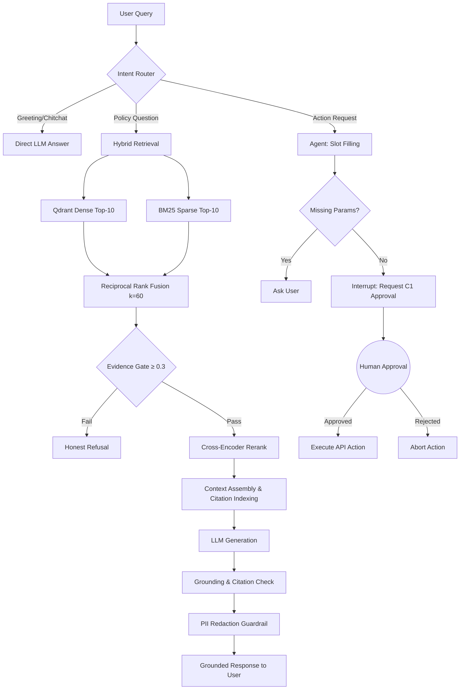

<div align="center">
  <h1>🧠 MAIA — Intelligent RAG Knowledge Platform</h1>
  <p><strong>Enterprise-Grade Internal Knowledge Assistant & Autonomous Agent</strong></p>

  [](https://python.org)
  [](https://fastapi.tiangolo.com/)
  [](https://streamlit.io/)
  [](https://langchain.com/)
  [](https://qdrant.tech/)
  [](https://docker.com)
  [](#)

  [**Live API**](https://maia-api-irau.onrender.com/docs) • [**Live UI**](https://maia-ui.onrender.com)
</div>

---

**MAIA** is an advanced Retrieval-Augmented Generation (RAG) platform and intelligent agent designed for enterprise internal operations. It securely answers HR, IT, and Security policy questions based on a designated company document corpus, with zero tolerance for hallucination. Beyond Q&A, MAIA acts as an autonomous agent that can execute side-effect actions (e.g., submitting leave requests, creating IT tickets) safely through a strict **Human-in-the-Loop (HITL)** approval workflow.

Core workflow: `Find → Understand → Cite → Act`

## ✨ Key Engineering Features

- **Hybrid RAG Pipeline with RRF**: Combines Dense (Qdrant) and Sparse (BM25) retrieval, fused via Reciprocal Rank Fusion (RRF), ensuring high recall across semantic and keyword queries.
- **Evidence Gate & Zero Hallucination**: Incorporates a strict similarity threshold (≥ 0.3). If no relevant documents are found, MAIA honestly refuses to answer instead of hallucinating.
- **Verifiable Grounding & Citation**: Every factual response is explicitly backed by `[S1]`, `[S2]` citations, linking back to the exact source file, section, and snippet.
- **Human-in-the-Loop (HITL) Action Execution (C1)**: Built with LangGraph StateGraphs and SQLite checkpointing. Any action causing a side-effect triggers an interrupt, pending explicit human approval via the `/actions/confirm` endpoint before resuming.
- **Enterprise Security & PII Protection**: 2-layer Personal Identifiable Information (PII) scanning (ingestion-time + output guardrail) prevents data leakage. Role-specific emails (e.g., `hr@`, `security@`) are allowlisted.
- **Multi-Tenant Isolation**: Complete isolation of queries, retrieval, and session memory by `tenant_id` at the Qdrant payload and database level.
- **Offline-First Development**: Runs with zero cloud dependencies when no Cloudflare credentials are set (every connector degrades to a local mock), and `MAIA_EMBED_FORCE_HASH=1` forces the deterministic hash embedder for tests.
- **Long-Term Memory**: Maintains cross-session memory for user preferences and facts, stored securely in SQLite.

## 🏗️ Architecture

### Hybrid RAG & Agent Pipeline



## 🛠️ Technology Stack

- **Backend Framework**: Python 3.12, FastAPI, Uvicorn, Pydantic Settings
- **Agent Orchestration**: LangGraph (StateGraph, HITL interrupt/resume), LangChain Core
- **Data & Vector Plane**: LlamaIndex Core, Qdrant (cosine metric), FastEmbed (ONNX), BM25Okapi
- **LLM Engine**: Cloudflare Workers AI (Llama 3.1-8b-instruct) / Mock Mode (offline)
- **Frontend UI**: Streamlit (Rich Chat UI, Dark/Light Mode, CSS Theming)
- **Storage & State**: SQLite WAL (Auth, Workflow, Sessions, LTM, LangGraph Checkpoints)
- **Authentication**: JWT + bcrypt + Google OAuth 2.0, RBAC (Admin/User)
- **Infrastructure**: Docker, Docker Compose, Alembic Migrations, Render Blueprints
- **Web Scraping**: Trafilatura (with SSRF protection)

## 🚀 Quick Start

### 1. Offline Mode (Zero Cloud Dependencies)
Run the entire platform locally without requiring external API keys.

```bash
# Set offline mode environment variables
export MAIA_EMBED_FORCE_HASH=1
export PYTHONPATH=src

# Install dependencies
pip install -r requirements.txt

# Ingest test enterprise documents
python -m maia.cli ingest --enterprise

# Terminal 1: Start the Backend API
uvicorn maia.api:app --port 8000 --reload

# Terminal 2: Start the Frontend UI
streamlit run app_streamlit.py
```

### 2. Docker Compose (Full Stack)
Spin up the backend, frontend, and vector database seamlessly.

```bash
docker compose up -d
```

## 🔌 Core API Endpoints

The system provides 40+ endpoints. Here are the core services:

| Category | Endpoints | Description |
|----------|-----------|-------------|
| **Auth** | `/auth/login`, `/auth/google` | JWT authentication and OAuth2 integration. |
| **RAG** | `/chat`, `/agent/chat` | Main interaction endpoints (single-turn & LangGraph agentic). |
| **Knowledge** | `/ingest/upload`, `/ingest/url` | Document ingestion with chunking and embedding. |
| **Actions (HITL)** | `/actions/pending`, `/actions/confirm` | Manage and confirm pending side-effect executions. |
| **Tools** | `/tools/leave/request`, `/tools/it/ticket` | Tool execution interfaces for the agent. |
| **Memory** | `/memory/store`, `/memory/recall` | Explicit memory management API. |

## 📂 Project Structure

```text
├── src/maia/
│   ├── agent/            # LangGraph StateGraph, intent router, tools, ITSM adapters
│   ├── loops/            # Guardrails, PII, grounding check, citation check, eval
│   ├── api.py            # FastAPI Application (RAG, Chat, Auth, Admin, HITL)
│   ├── retriever.py      # Hybrid Dense+BM25 → RRF
│   ├── embeddings.py     # FastEmbed/Cloudflare/Hash abstractions
│   ├── vector_store.py   # Qdrant adapter
│   ├── reranker.py       # Cross-Encoder + RRF fallback
│   ├── workflow.py       # Approval state management (SQLite)
│   └── config.py         # Centralized pydantic-settings
├── app_streamlit.py      # Streamlit conversational interface
├── data/enterprise/      # Sample company policy documents
├── eval/                 # Benchmark datasets (73 golden test cases)
├── tests/                # 128+ offline unit & integration tests
├── deploy/docker/        # Infrastructure orchestration
├── alembic/              # Database schema migrations
└── render.yaml           # Render Cloud Blueprint deployment
```

## 🧪 Testing & Evaluation

The platform is built with rigorous testing standards, featuring over 128 tests that can run entirely offline.

```bash
# Run the test suite in full offline mock mode
MAIA_EMBED_FORCE_HASH=1 pytest tests/ -q

# Run internal benchmark evaluations against golden datasets
PYTHONPATH=src python -m maia.eval eval/dataset.jsonl
```

## 🌐 Live Deployment

- **Backend API**: [https://maia-api-irau.onrender.com/docs](https://maia-api-irau.onrender.com/docs)
- **Frontend UI**: [https://maia-ui.onrender.com](https://maia-ui.onrender.com) (Requires Google OAuth Login)

---
*Developed by [imtarget05](https://github.com/imtarget05)*
