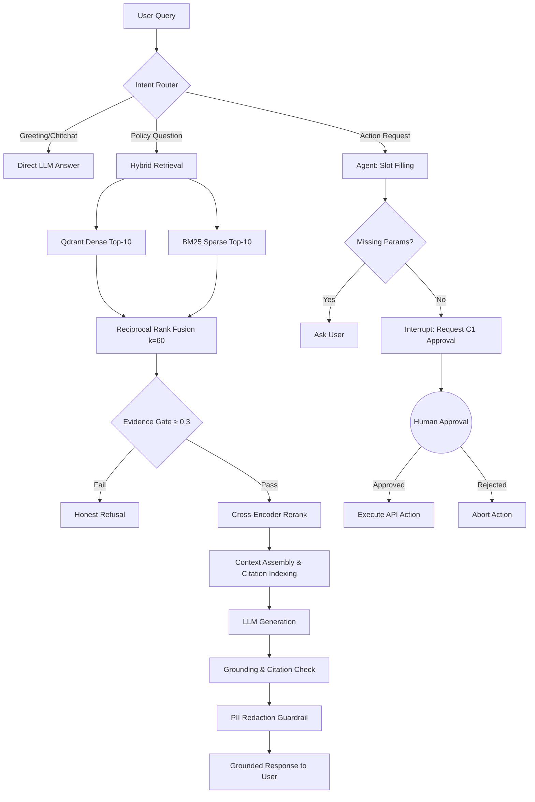

<div align="center">
  <h1>🧠 MAIA — Intelligent RAG Knowledge Platform</h1>
  <p><strong>Enterprise-Grade Internal Knowledge Assistant & Autonomous Agent</strong></p>

  [](https://python.org)
  [](https://fastapi.tiangolo.com/)
  [](https://streamlit.io/)
  [](https://langchain.com/)
  [](https://qdrant.tech/)
  [](https://docker.com)
  [](#)

  [**Quick Start**](#-quick-start) • [**Architecture**](#-architecture)
</div>

---

**MAIA** is an advanced Retrieval-Augmented Generation (RAG) platform and intelligent agent designed for enterprise internal operations. It securely answers HR, IT, and Security policy questions based on a designated company document corpus, with zero tolerance for hallucination. Beyond Q&A, MAIA acts as an autonomous agent that can execute side-effect actions (e.g., submitting leave requests, creating IT tickets) safely through a strict **Human-in-the-Loop (HITL)** approval workflow.

Core workflow: `Find → Understand → Cite → Act`

## ✨ Key Engineering Features

- **Hybrid RAG Pipeline with RRF**: Combines Dense (Qdrant) and Sparse (BM25) retrieval, fused via Reciprocal Rank Fusion (RRF), ensuring high recall across semantic and keyword queries.
- **Evidence Gate & Zero Hallucination**: Incorporates a strict similarity threshold (≥ 0.3). If no relevant documents are found, MAIA honestly refuses to answer instead of hallucinating.
- **Verifiable Grounding & Citation**: Every factual response is explicitly backed by `[S1]`, `[S2]` citations, linking back to the exact source file, section, and snippet.
- **Human-in-the-Loop (HITL) Action Execution (C1)**: Built with LangGraph StateGraphs and SQLite checkpointing. Any action causing a side-effect triggers an interrupt, pending explicit human approval via the `/actions/confirm` endpoint before resuming.
- **Enterprise Security & PII Protection**: 2-layer Personal Identifiable Information (PII) scanning (ingestion-time + output guardrail) prevents data leakage. Role-specific emails (e.g., `hr@`, `security@`) are allowlisted.
- **Multi-Tenant Isolation**: Complete isolation of queries, retrieval, and session memory by `tenant_id` at the Qdrant payload and database level.
- **Offline-First Development**: Runs with zero cloud dependencies when no Cloudflare credentials are set (every connector degrades to a local mock), and `MAIA_EMBED_FORCE_HASH=1` forces the deterministic hash embedder for tests.
- **Long-Term Memory**: Maintains cross-session memory for user preferences and facts, stored securely in SQLite.
- **PromptOps — prompts as versioned artefacts**: Prompts live in `prompts/**/<name>.v<semver>.yaml` with bounded parameters, declared guardrails, a JSON output schema and their own eval suite. `PromptRegistry.diff(a, b)` turns a prompt change into a reviewable diff; the offline golden suite runs without a model. ([docs](docs/PROMPT_ENGINEERING_GUIDE.md))
- **Model Context Protocol (MCP) tool-calling**: A real JSON-RPC 2.0 implementation (`initialize` → `tools/list` → `tools/call`) with in-process and stdio-subprocess transports, so the same servers serve the API, the agent and an external MCP client (`python -m maia.mcp.bridge`). ([docs](docs/MCP_INTEGRATION.md))
- **Marketing/Product data plane**: Idempotent connectors (file/JSONL/CSV + opt-in HTTP with cursor pagination) land in a SQLite mini-warehouse with a run ledger; deterministic analytics (lexicon sentiment, topic buckets, KPI rollups, week-over-week + z-score drop detection) and a rule-based NL→SQL planner that **refuses** instead of guessing.
- **Integration tools, honestly**: Airtable, email, MS Teams and Zalo OA are exposed as MCP tools. Without credentials they run against a local store and report `dry_run: true` / `delivered: false` — never a fake success. Agent-driven calls pass an allowlist, a per-turn budget and a value-free audit log.

## 🏗️ Architecture

### Hybrid RAG & Agent Pipeline


```mermaid
graph TD
    A[User Query] --> B{Intent Router}
    B -->|Greeting/Chitchat| C[Direct LLM Answer]
    B -->|Policy Question| D[Hybrid Retrieval]
    B -->|Action Request| E[Agent: Slot Filling]

    D --> D1[Qdrant Dense Top-10]
    D --> D2[BM25 Sparse Top-10]
    D1 --> F[Reciprocal Rank Fusion k=60]
    D2 --> F
    
    F --> G{Evidence Gate ≥ 0.3}
    G -->|Fail| H[Honest Refusal]
    G -->|Pass| I[Cross-Encoder Rerank]
    
    I --> J[Context Assembly & Citation Indexing]
    J --> K[LLM Generation]
    K --> L[Grounding & Citation Check]
    L --> M[PII Redaction Guardrail]
    M --> N[Grounded Response to User]

    E --> O{Missing Params?}
    O -->|Yes| P[Ask User]
    O -->|No| Q[Interrupt: Request C1 Approval]
    Q --> R((Human Approval))
    R -->|Approved| S[Execute API Action]
    R -->|Rejected| T[Abort Action]
```

## 🛠️ Technology Stack

- **Backend Framework**: Python 3.12, FastAPI, Uvicorn, Pydantic Settings
- **Agent Orchestration**: LangGraph (StateGraph, HITL interrupt/resume), LangChain Core
- **Data & Vector Plane**: LlamaIndex Core, Qdrant (cosine metric), FastEmbed (ONNX), BM25Okapi
- **LLM Engine**: Cloudflare Workers AI (Llama 3.1-8b-instruct) / Mock Mode (offline)
- **Frontend UI**: Streamlit (Rich Chat UI, Dark/Light Mode, CSS Theming)
- **Storage & State**: SQLite WAL (Auth, Workflow, Sessions, LTM, LangGraph Checkpoints)
- **Authentication**: JWT + bcrypt + Google OAuth 2.0, RBAC (Admin/User)
- **Infrastructure**: Docker, Docker Compose, Alembic Migrations, Render Blueprints
- **Web Scraping**: Trafilatura (with SSRF protection)

## 🚀 Quick Start

### 1. Offline Mode (Zero Cloud Dependencies)
Run the entire platform locally without requiring external API keys.

```bash
# Set offline mode environment variables
export MAIA_EMBED_FORCE_HASH=1
export PYTHONPATH=src

# Install dependencies
pip install -r requirements.txt

# Ingest test enterprise documents
python -m maia.cli ingest --enterprise

# Terminal 1: Start the Backend API
uvicorn maia.api:app --port 8000 --reload

# Terminal 2: Start the Frontend UI
streamlit run app_streamlit.py
```

### 2. Docker Compose (Full Stack)
Spin up the backend, frontend, and vector database seamlessly.

```bash
docker compose up -d
```

## 🔌 Core API Endpoints

The system provides 40+ endpoints. Here are the core services:

| Category | Endpoints | Description |
|----------|-----------|-------------|
| **Auth** | `/auth/login`, `/auth/google` | JWT authentication and OAuth2 integration. |
| **RAG** | `/chat`, `/agent/chat` | Main interaction endpoints (single-turn & LangGraph agentic). |
| **Knowledge** | `/ingest/upload`, `/ingest/url` | Document ingestion with chunking and embedding. |
| **Actions (HITL)** | `/actions/pending`, `/actions/confirm` | Manage and confirm pending side-effect executions. |
| **Tools** | `/tools/leave/request`, `/tools/it/ticket` | Tool execution interfaces for the agent. |
| **Memory** | `/memory/store`, `/memory/recall` | Explicit memory management API. |

## 📂 Project Structure

```text
├── src/maia/
│   ├── agent/            # LangGraph StateGraph, intent router, tools, ITSM adapters
│   ├── loops/            # Guardrails, PII, grounding check, citation check, eval
│   ├── promptops/        # PromptOps: versioned prompt library, render, eval gate
│   ├── mcp/              # Model Context Protocol: server/client/transports + integrations
│   ├── pipeline/         # Marketing data plane: collectors, warehouse, analytics, NL→SQL
│   ├── json_schema_lite.py # JSON-Schema validation adapter (prompts + MCP tools)
│   ├── sql_guard.py      # Read-only SQL policy shared by the warehouse and MCP tools
│   ├── scenarios.py      # 3 end-to-end showcase flows (review/campaign/KPI alert)
│   ├── market_api.py     # /api/v1/market router (prompts, MCP, pipeline, scenarios)
│   ├── api.py            # FastAPI Application (RAG, Chat, Auth, Admin, HITL)
│   ├── retriever.py      # Hybrid Dense+BM25 → RRF
│   ├── embeddings.py     # FastEmbed/Cloudflare/Hash abstractions
│   ├── vector_store.py   # Qdrant adapter
│   ├── reranker.py       # Cross-Encoder + RRF fallback
│   ├── workflow.py       # Approval state management (SQLite)
│   └── config.py         # Centralized pydantic-settings
├── prompts/              # Versioned prompt library (semver + eval cases)
├── data/market/          # Marketing fixtures: reviews (JSONL) + campaign metrics (CSV)
├── app_streamlit.py      # Streamlit conversational interface
├── data/enterprise/      # Sample company policy documents
├── eval/                 # Benchmark datasets (73 golden test cases)
├── tests/                # 812 offline unit & integration tests
├── deploy/docker/        # Infrastructure orchestration
├── alembic/              # Database schema migrations
└── render.yaml           # Render Cloud Blueprint deployment
```

## 🧪 Testing & Evaluation

The platform is built with rigorous testing standards, featuring over 812 tests that can run entirely offline.

```bash
# Run the test suite in full offline mock mode
MAIA_EMBED_FORCE_HASH=1 pytest tests/ -q

# PromptOps only: prompt library policy + offline eval gate
pytest tests/test_prompt_library.py tests/test_prompt_evals.py -q

# MCP: protocol, real stdio subprocess, integrations, agent dispatch policy
pytest tests/test_mcp_protocol.py tests/test_mcp_client.py \
       tests/test_mcp_servers.py tests/test_mcp_dispatch.py -q

# Data plane: SQL guard, connectors, warehouse, analytics, NL→SQL, scenarios
pytest tests/test_pipeline.py tests/test_scenarios.py -q

# Run internal benchmark evaluations against golden datasets
PYTHONPATH=src python -m maia.eval eval/dataset.jsonl
```

### Demo the new surfaces (2 phút, offline)

```bash
curl -s localhost:8000/api/v1/market/scenarios | jq                    # 3 kịch bản
curl -sX POST localhost:8000/api/v1/market/scenarios/run \
  -H 'content-type: application/json' \
  -d '{"name":"review_insight_report","params":{"fixture":"samples/game_reviews.jsonl","game_id":"demo-game"}}' | jq
python -m maia.mcp.bridge --server market_insight --list-tools | jq '.tools[].name'
```

## 🌐 Deployment status (cập nhật 2026-09-28)

Các link Render free-tier cũ (`maia-api-irau.onrender.com`, `maia-ui.onrender.com`)
hiện trả về **HTTP 503** khi kiểm chứng (service dừng/sleep) — **không dùng link
này làm demo**. Cách dựng lại:

- **Local (khuyến nghị, hoạt động offline):** `docker compose up -d` → API
  `http://localhost:8000/docs`, UI `http://localhost:8501` (xem Quick Start).
- **Cloud:** `render.yaml` là Render Blueprint — fork repo → New → Blueprint,
  set `JWT_SECRET_KEY`, embedding/model env theo `src/maia/config.py`.
- **CI làm bằng chứng vận hành:** `.github/workflows/{ci,cd}.yml` (ruff, pyright,
  pytest với Qdrant service container, push image GHCR).

---
*Developed by [imtarget05](https://github.com/imtarget05)*
