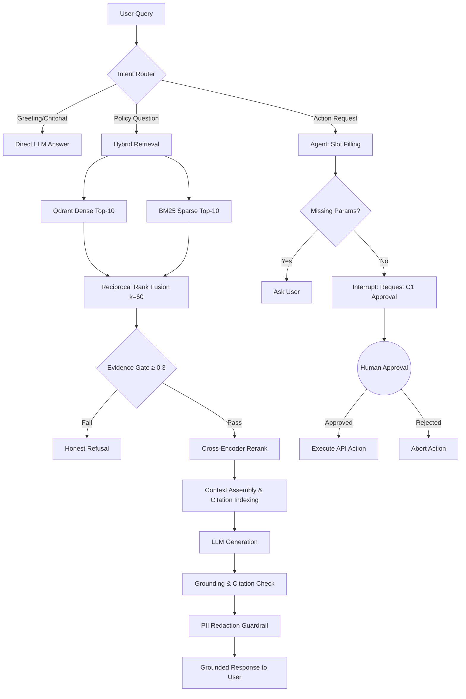

<div align="center">
  <h1>🧠 MAIA — Intelligent RAG Knowledge Platform</h1>
  <p><strong>Internal Knowledge Assistant & Autonomous Agent</strong></p>

  [](https://python.org)
  [](https://fastapi.tiangolo.com/)
  [](https://streamlit.io/)
  [](https://langchain.com/)
  [](https://qdrant.tech/)
  [](https://docker.com)
  [](https://github.com/imtarget05/MAIA/actions/workflows/ci.yml)
  [](https://ca-maia-api.wittysand-b748274c.eastasia.azurecontainerapps.io/health)

  [**Quick Start**](#-quick-start) • [**Architecture**](#-architecture)
</div>

---

**MAIA** is a Retrieval-Augmented Generation (RAG) platform and agent for
enterprise internal operations. It answers HR, IT, and Security policy questions
from a designated company document corpus, and it is built to refuse rather than
guess: an evidence gate blocks answers whose retrieved evidence is below a
similarity threshold. That refusal behaviour is **measured, not assumed** — see
[Honest status of the answerability gate](#honest-status-of-the-answerability-gate),
which reports a failing gate and why no threshold fixes it. Beyond Q&A, MAIA acts
as an autonomous agent that can execute side-effect actions (e.g., submitting
leave requests, creating IT tickets) safely through a strict **Human-in-the-Loop
(HITL)** approval workflow.

Core workflow: `Find → Understand → Cite → Act`

## ✨ Key Engineering Features

- **Hybrid RAG Pipeline with RRF**: Combines Dense (Qdrant) and Sparse (BM25) retrieval, fused via Reciprocal Rank Fusion (RRF), ensuring high recall across semantic and keyword queries.
- **Evidence Gate (measured, currently failing)**: A similarity threshold (`SIMILARITY_THRESHOLD`, ≥ 0.3) gates answers on retrieved evidence. The gate is implemented and tested, and the abstention gate that measures it **exits 1**: it authorised 8 of 9 labelled no-answer queries. This is a published defect, not a claim — see the gate section below and `eval/README.md:16`.
- **Citation projection, not guaranteed grounding**: Answers carry `[S1]`, `[S2]` citations pointing at a source file, section and snippet, and there is a grounding/citation check in the pipeline. A `citations` frame or footer is **not** evidence that an answer is grounded: the frame is empty when retrieval returns nothing, and the one live probe recorded `citations([])`.
- **Human-in-the-Loop (HITL) Action Execution (C1)**: Built with LangGraph StateGraphs and SQLite checkpointing. Any action causing a side-effect triggers an interrupt, pending explicit human approval via the `/actions/confirm` endpoint before resuming.
- **Enterprise Security & PII Protection**: 2-layer Personal Identifiable Information (PII) scanning (ingestion-time + output guardrail) prevents data leakage. Role-specific emails (e.g., `hr@`, `security@`) are allowlisted.
- **Multi-Tenant Isolation**: Complete isolation of queries, retrieval, and session memory by `tenant_id` at the Qdrant payload and database level.
- **Offline-First Development**: Runs with zero cloud dependencies when no Cloudflare credentials are set (every connector degrades to a local mock), and `MAIA_EMBED_FORCE_HASH=1` forces the deterministic hash embedder for tests.
- **Long-Term Memory**: Maintains cross-session memory for user preferences and facts, stored securely in SQLite.
- **PromptOps — prompts as versioned artefacts**: Prompts live in `prompts/**/<name>.v<semver>.yaml` with bounded parameters, declared guardrails, a JSON output schema and their own eval suite. `PromptRegistry.diff(a, b)` turns a prompt change into a reviewable diff; the offline golden suite runs without a model. ([docs](docs/PROMPT_ENGINEERING_GUIDE.md))
- **Model Context Protocol (MCP) tool-calling**: A real JSON-RPC 2.0 implementation (`initialize` → `tools/list` → `tools/call`) with in-process and stdio-subprocess transports, so the same servers serve the API, the agent and an external MCP client (`python -m maia.mcp.bridge`). ([docs](docs/MCP_INTEGRATION.md))
- **Marketing/Product data plane**: Idempotent connectors (file/JSONL/CSV + opt-in HTTP with cursor pagination) land in a SQLite mini-warehouse with a run ledger; deterministic analytics (lexicon sentiment, topic buckets, KPI rollups, week-over-week + z-score drop detection) and a rule-based NL→SQL planner that **refuses** instead of guessing.
- **Integration tools, honestly**: Airtable, email, MS Teams and Zalo OA are exposed as MCP tools. Without credentials they run against a local store and report `dry_run: true` / `delivered: false` — never a fake success. Agent-driven calls pass an allowlist, a per-turn budget and a value-free audit log.

## 🏗️ Architecture

### Hybrid RAG & Agent Pipeline


```mermaid
graph TD
    A[User Query] --> B{Intent Router}
    B -->|Greeting/Chitchat| C[Direct LLM Answer]
    B -->|Policy Question| D[Hybrid Retrieval]
    B -->|Action Request| E[Agent: Slot Filling]

    D --> D1[Qdrant Dense Top-10]
    D --> D2[BM25 Sparse Top-10]
    D1 --> F[Reciprocal Rank Fusion k=60]
    D2 --> F
    
    F --> G{Evidence Gate ≥ 0.3}
    G -->|Fail| H[Honest Refusal]
    G -->|Pass| I[Cross-Encoder Rerank]
    
    I --> J[Context Assembly & Citation Indexing]
    J --> K[LLM Generation]
    K --> L[Grounding & Citation Check]
    L --> M[PII Redaction Guardrail]
    M --> N[Grounded Response to User]

    E --> O{Missing Params?}
    O -->|Yes| P[Ask User]
    O -->|No| Q[Interrupt: Request C1 Approval]
    Q --> R((Human Approval))
    R -->|Approved| S[Execute API Action]
    R -->|Rejected| T[Abort Action]
```

## 🛠️ Technology Stack

- **Backend Framework**: Python 3.12, FastAPI, Uvicorn, Pydantic Settings
- **Agent Orchestration**: LangGraph (StateGraph, HITL interrupt/resume), LangChain Core
- **Data & Vector Plane**: LlamaIndex Core, Qdrant (cosine metric), FastEmbed (ONNX), BM25Okapi
- **LLM Engine**: Cloudflare Workers AI (Llama 3.1-8b-instruct) / Mock Mode (offline)
- **Frontend UI**: Streamlit (Rich Chat UI, Dark/Light Mode, CSS Theming)
- **Storage & State**: SQLite WAL (Auth, Workflow, Sessions, LTM, LangGraph Checkpoints)
- **Authentication**: JWT + bcrypt + Google OAuth 2.0, RBAC (Admin/User)
- **Infrastructure**: Docker, Docker Compose, Alembic Migrations; Azure Container Apps (current) via Bicep in `infra/`; Render Blueprints retained as superseded legacy
- **Web Scraping**: Trafilatura (with SSRF protection)

## 🚀 Quick Start

### 1. Offline Mode (Zero Cloud Dependencies)
Run the entire platform locally without requiring external API keys.

```bash
# Set offline mode environment variables
export MAIA_EMBED_FORCE_HASH=1
export PYTHONPATH=src

# Install dependencies
pip install -r requirements.txt

# Ingest test enterprise documents
python -m maia.cli ingest --enterprise

# Terminal 1: Start the Backend API
uvicorn maia.api:app --port 8000 --reload

# Terminal 2: Start the Frontend UI
streamlit run app_streamlit.py
```

### 2. Docker Compose (Full Stack)
Spin up the backend, frontend, and vector database seamlessly.

```bash
docker compose up -d
```

## 🔌 Core API Endpoints

The system provides 40+ endpoints. Here are the core services:

| Category | Endpoints | Description |
|----------|-----------|-------------|
| **Auth** | `/auth/login`, `/auth/google` | JWT authentication and OAuth2 integration. |
| **RAG** | `/chat`, `/agent/chat` | Main interaction endpoints (single-turn & LangGraph agentic). |
| **Streaming** | `POST /chat/stream` | SSE token streaming: `meta → token* → citations → done` (typed events, auth + tenant enforced, disconnect cancels, `approval_required` pauses HIGH_RISK instead of executing). See `docs/evidence/stream_closeout.md`. |
| **Knowledge** | `/ingest/upload`, `/ingest/url` | Document ingestion with chunking and embedding. |
| **Actions (HITL)** | `/actions/pending`, `/actions/confirm` | Manage and confirm pending side-effect executions. |
| **Tools** | `/tools/leave/request`, `/tools/it/ticket` | Tool execution interfaces for the agent. |
| **Memory** | `/memory/store`, `/memory/recall` | Explicit memory management API. |

## 📂 Project Structure

```text
├── src/maia/
│   ├── agent/            # LangGraph StateGraph, intent router, tools, ITSM adapters
│   ├── loops/            # Guardrails, PII, grounding check, citation check, eval
│   ├── promptops/        # PromptOps: versioned prompt library, render, eval gate
│   ├── mcp/              # Model Context Protocol: server/client/transports + integrations
│   ├── pipeline/         # Marketing data plane: collectors, warehouse, analytics, NL→SQL
│   ├── json_schema_lite.py # JSON-Schema validation adapter (prompts + MCP tools)
│   ├── sql_guard.py      # Read-only SQL policy shared by the warehouse and MCP tools
│   ├── scenarios.py      # 3 end-to-end showcase flows (review/campaign/KPI alert)
│   ├── market_api.py     # /api/v1/market router (prompts, MCP, pipeline, scenarios)
│   ├── api.py            # FastAPI Application (RAG, Chat, Auth, Admin, HITL)
│   ├── streaming.py      # SSE event contract + deferred session persistence
│   ├── retriever.py      # Hybrid Dense+BM25 → RRF
│   ├── embeddings.py     # FastEmbed/Cloudflare/Hash abstractions
│   ├── vector_store.py   # Qdrant adapter
│   ├── reranker.py       # Cross-Encoder + RRF fallback
│   ├── workflow.py       # Approval state management (SQLite)
│   └── config.py         # Centralized pydantic-settings
├── prompts/              # Versioned prompt library (semver + eval cases)
├── data/market/          # Marketing fixtures: reviews (JSONL) + campaign metrics (CSV)
├── app_streamlit.py      # Streamlit conversational interface
├── data/enterprise/      # Sample company policy documents
├── eval/                 # Golden benchmark datasets — 10 groups, 98 rows (`eval/golden/`)
├── tests/                # offline unit & integration suite
├── deploy/docker/        # Infrastructure orchestration
├── alembic/              # Database schema migrations
└── render.yaml           # Render Cloud Blueprint — SUPERSEDED legacy path (see Deployment status)
```

## 🧪 Testing & Evaluation

The full suite runs entirely offline. The measured figures below are the source of
truth for how much is verified; the per-feature evidence chain is in
`docs/evidence/stream_closeout.md`.

**Measured on `main` at `8ced0695`**, with `MAIA_EMBED_FORCE_HASH=1` and
`pytest tests/ -m "not live and not infra" --strict-markers`:

```text
1163 passed, 14 skipped, 2 deselected, 3 xfailed, 0 failed
```

The 14 skips are environment-gated, **not failures**: 10 require a running
Qdrant (`tests/test_tracing.py`, `tests/test_threshold_regression.py`,
`tests/test_golden_eval.py` — each skips with "Qdrant not available - set
`QDRANT_URL`"), 1 requires `azure-search-documents`, 2 require
`MAIA_POSTGRES_DSN`, and 1 is a deliberate skip at
`tests/test_azure_identity.py:564`. Docker was unavailable for that run, so a
Qdrant-present figure was **NOT** re-measured and none is extrapolated here.
`.github/workflows/ci.yml` defines **15** job keys.

**Also measured at `8ced0695`:** `ruff check src/` clean; `pyright src/` = exactly
**4** errors, all `reportMissingImports` for optional deps — `torch` at
`ner_tool.py:76` and `:141`, `langgraph.checkpoint.postgres.aio` at
`persistence.py:75`, `psycopg_pool` at `persistence.py:100`.

**Reproduce (local):** `MAIA_EMBED_FORCE_HASH=1 pytest tests/ -m "not live and not infra" --strict-markers`

### Deployment evidence — three states, not one

| claim | state | evidence |
|---|---|---|
| SSE implementation and its regression tests | **VERIFIED** | `tests/test_chat_stream_sse.py` (16 tests), `tests/test_agent_chat_api.py`; contract in `docs/evidence/stream_closeout.md` |
| The deployed revision that carries this code | **two identities, unresolved** | `ca-maia-api--0000006` / `a82f24b` backs the streaming + test-count evidence; `ca-maia-api--0000012` / `b53aca4` is the newest documented deployment (`docs/azure-integration.md` §7). **Which revision currently serves traffic is NOT VERIFIED.** |
| Authenticated Azure SSE end-to-end, and `/query` real-RAG against Qdrant Cloud | **NOT VERIFIED** | no retained artifact. The one retained live probe ran with the vector store unreachable and returned `citations([])` — see `docs/evidence/stream_closeout.md` §8–9 |

No liveness or traffic-split claim is made here, because nothing committed
re-establishes one.

> Historical figures, retained because the streaming evidence was produced there:
> CI run `36819947283` at `a82f24b` was GREEN with `998 passed, 12 skipped, 2
> deselected, 3 xfailed`; run `36768831367` at `2d2eaf9` was GREEN with `987
> passed, 12 skipped, 2 deselected, 3 xfailed`. The `967 @ 38189ca`, `981 @ 20ec528`
> and dirty-worktree `997` figures are likewise historical. The former single
> residual (`test_format_checker_rejects_bad_datetime`) was fixed by registering a
> stdlib RFC-3339 date-time check; the live-probe error-path defect
> (`llm.mode` on None) was fixed by degrading to `"unknown"`. Proof chain in
> `docs/evidence/stream_closeout.md`.

### Honest status of the answerability gate

**MEASURED DEFECT.** The abstention gate **fails, and the failure is published
rather than tuned away**. Gate 8B-C reports `status: "FAIL"` and exits `1`: 9 of
11 checks pass, `B8B1` and `B8B3` fail.

```text
abstention_rate        0.1111   (1 of 9 labelled no-answer queries refused, n = 9)
separable              false
max no-answer top_dense  0.6957
min answerable top_dense 0.3140
```

Because `max(no-answer) >= min(answerable)`, the two classes **overlap**, so no
value of `SIMILARITY_THRESHOLD` separates them: any threshold low enough to
refuse all 9 no-answer queries also refuses the weakest genuine answer. A cosine
score on the top chunk measures topical similarity, not answerability.

The corpus is labelled, so this is a measurement and not a blind spot:
`eval/audit_eval_rows.py --only no_answer` reports
`rows=9 usable=7 unusable=1 rejected=1`, i.e. **7 usable of 9**. `NOANS-009` was
rejected after corpus verification contradicted its label; the audit CLI keeps
retired rows in place, so the record that a label was corrected is not lost.

**Closing this needs a different decision signal, not a threshold change** —
answer-span verification or an NLI entailment check. No threshold was tuned and
no golden row was relabelled to reach a target number; see `eval/README.md:16`.

Source of truth: `eval/README.md:16-40` and the artifact
`../docs/evidence/e2e/gate8b-abstention.json` — **that artifact lives in the
sibling `Projects/docs` repository, so a clone of MAIA alone does not contain
it.** Environment-dependent numbers in this section are stated from the artifact,
not hardcoded here.

```bash
# Run the test suite in full offline mock mode
MAIA_EMBED_FORCE_HASH=1 pytest tests/ -q

# PromptOps only: prompt library policy + offline eval gate
pytest tests/test_prompt_library.py tests/test_prompt_evals.py -q

# MCP: protocol, real stdio subprocess, integrations, agent dispatch policy
pytest tests/test_mcp_protocol.py tests/test_mcp_client.py \
       tests/test_mcp_servers.py tests/test_mcp_dispatch.py -q

# Data plane: SQL guard, connectors, warehouse, analytics, NL→SQL, scenarios
pytest tests/test_pipeline.py tests/test_scenarios.py -q

# Run internal benchmark evaluations against golden datasets
PYTHONPATH=src python -m maia.eval eval/dataset.jsonl
```

### Demo the new surfaces (2 phút, offline)

```bash
curl -s localhost:8000/api/v1/market/scenarios | jq                    # 3 kịch bản
curl -sX POST localhost:8000/api/v1/market/scenarios/run \
  -H 'content-type: application/json' \
  -d '{"name":"review_insight_report","params":{"fixture":"samples/game_reviews.jsonl","game_id":"demo-game"}}' | jq
python -m maia.mcp.bridge --server market_insight --list-tools | jq '.tools[].name'
```

## 🌐 Deployment status

**Current platform: Azure Container Apps.** See `docs/azure-integration.md` §7.
What is and is not verified about that deployment is stated there and in the
deployment-evidence table above; no liveness or traffic claim is made from this
README.

**Render is SUPERSEDED legacy.** The Render free-tier links
(`maia-api-irau.onrender.com`, `maia-ui.onrender.com`) returned **HTTP 503**
when last checked (service stopped/asleep) — **không dùng link này làm demo**.
`render.yaml`, `docs/deployment.md` and the `cd.yml` / `keepalive.yml`
workflows still contain Render references and are kept for history; they are
**not** the live path and nothing here depends on them.

Cách dựng lại:

- **Local (khuyến nghị, hoạt động offline):** `docker compose up -d` → API
  `http://localhost:8000/docs`, UI `http://localhost:8501` (xem Quick Start).
- **Cloud (current):** Azure Container Apps — Bicep templates in `infra/`,
  secrets via Key Vault with user-assigned managed identity, per
  `docs/azure-integration.md`.
- **Cloud (legacy, superseded):** `render.yaml` là Render Blueprint — fork repo
  → New → Blueprint, set `JWT_SECRET_KEY`, embedding/model env theo
  `src/maia/config.py`.
- **CI làm bằng chứng vận hành:** `.github/workflows/ci.yml` (ruff, pyright,
  pytest với Qdrant service container, push image GHCR). The job count and the
  measured suite figures are in the Testing section above.

---
*Developed by [imtarget05](https://github.com/imtarget05)*
