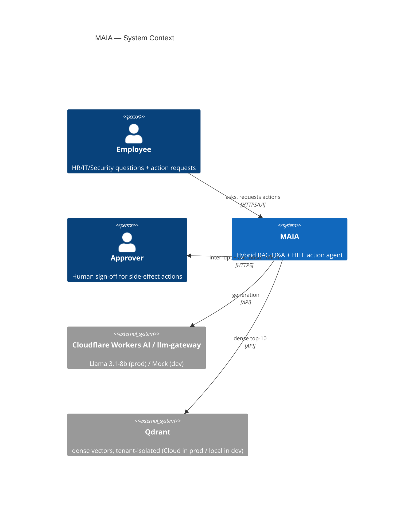
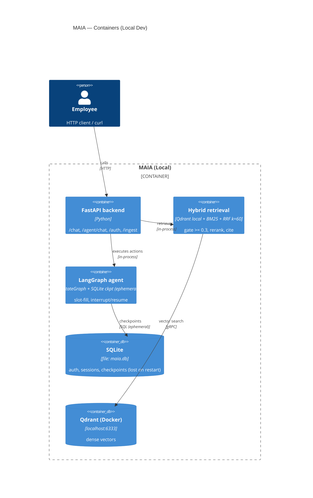
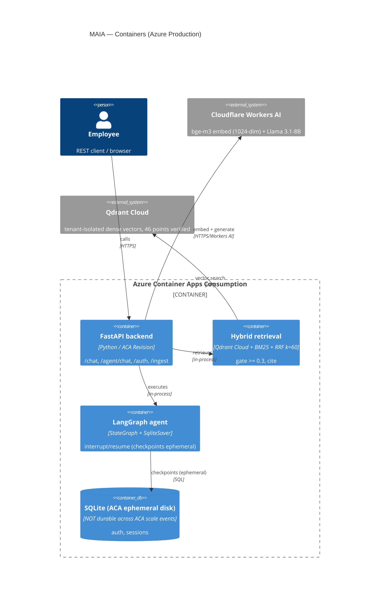

# MAIA — C4 Architecture

> Source of truth: `MAIA/README.md` (Hybrid RAG + Agent Pipeline diagram).
> Workflow: `Find → Understand → Cite → Act`.
>
> **Two deployment profiles exist; this document shows both. They are NOT interchangeable.**
> - **Local Dev / Demo**: FastEmbed (384-dim) + Qdrant (local container) + SQLite checkpoints
> - **Azure Production** (`ca-maia-api.wittysand-b748274c.eastasia.azurecontainerapps.io`):
>   Cloudflare Workers AI embeddings (1024-dim, `@cf/baai/bge-m3`) + Qdrant Cloud + SQLite on ACA ephemeral disk
>
> **Known gap (G-MAIA-01):** LangGraph durable graph uses `SqliteSaver` in both profiles.
> On Azure Container Apps (Consumption tier), the filesystem is ephemeral — checkpoints are
> NOT persisted across scale-in/out events. `persistence.py` provides an `AsyncPostgresSaver`
> wrapper but it is not wired to `get_durable_graph()` as of `658db396`. This is a
> `KNOWN_LIMITATION`, not an oversight: fixing it requires `MAIA_POSTGRES_DSN` to be
> provisioned and wired. See `docs/adr/0006-*` for the limitation boundary on answerability gate.

## C4-Context

## C4-Container (Local Dev Profile)

> This profile runs with `MAIA_LLM_PROVIDER=mock`, `VECTOR_STORE_BACKEND=qdrant` (local Docker),
> `AUTH_DB_URL=sqlite:///./maia.db`. Used by `scripts/run_demo_e2e.sh`.

## C4-Container (Azure Production Profile)

> Verified at `ca-maia-api.wittysand-b748274c.eastasia.azurecontainerapps.io` on 2026-10-02.
> See `docs/evidence/MAIA_AZURE_LIVE_PROOF.md` for 16/16 checks PASS.
>
> **Differences from local dev:**
> - Embeddings: Cloudflare Workers AI `@cf/baai/bge-m3` (1024-dim), not FastEmbed (384-dim)
> - Vector DB: Qdrant Cloud, not local container
> - LLM: Cloudflare Workers AI Llama 3.1-8B, not mock
> - Auth DB: SQLite on ACA ephemeral filesystem (checkpoints lost on restart — see KNOWN_LIMITATION above)
> - Streamlit UI: NOT deployed on Azure (REST API only via HTTP)

