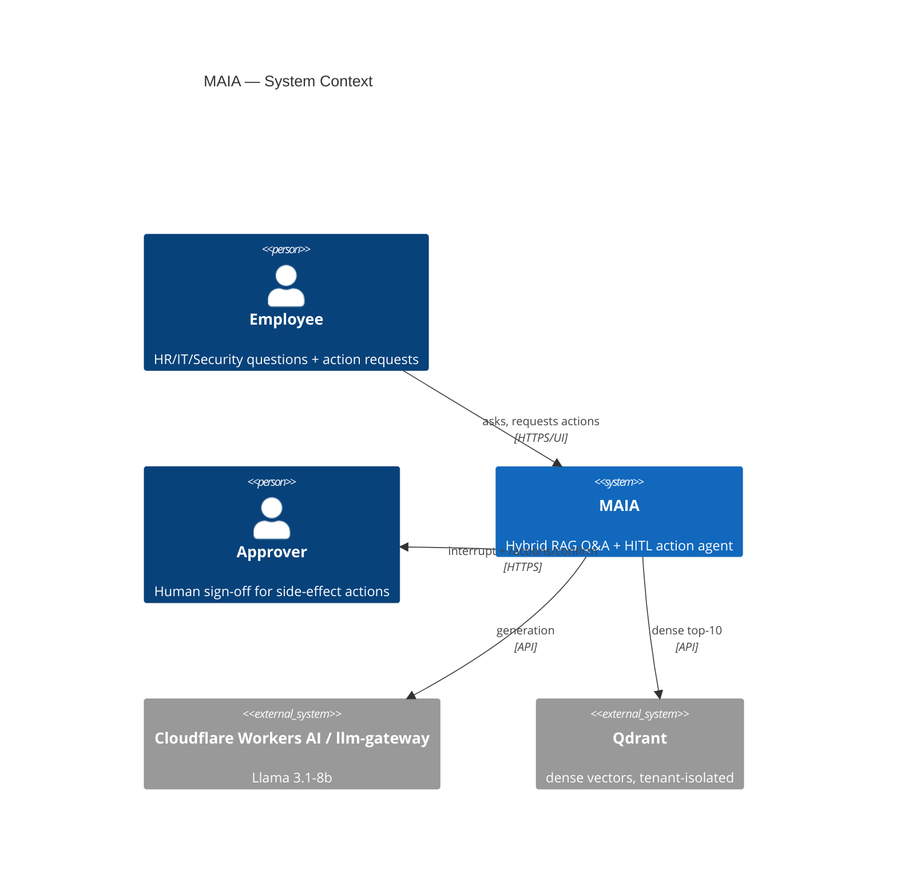
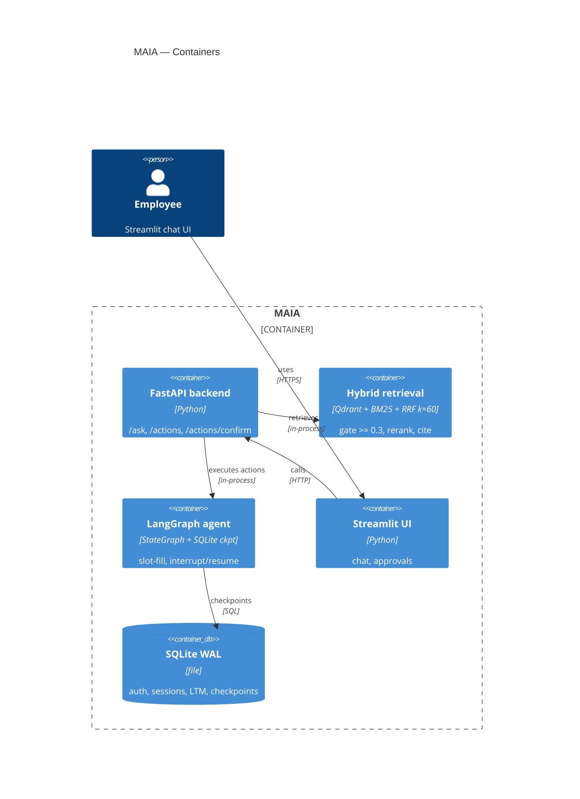

# MAIA — C4 Architecture

> Source of truth: `MAIA/README.md` (Hybrid RAG + Agent Pipeline diagram).
> Workflow: `Find → Understand → Cite → Act`.

## C4-Context

```mermaid
C4Context
    title MAIA — System Context
    Person(emp, "Employee", "HR/IT/Security questions + action requests")
    Person(appr, "Approver", "Human sign-off for side-effect actions")
    System(maia, "MAIA", "Hybrid RAG Q&A + HITL action agent")
    System_Ext(llm, "Cloudflare Workers AI / llm-gateway", "Llama 3.1-8b")
    System_Ext(qd, "Qdrant", "dense vectors, tenant-isolated")
    Rel(emp, maia, "asks, requests actions", "HTTPS/UI")
    Rel(maia, appr, "interrupt + /actions/confirm", "HTTPS")
    Rel(maia, llm, "generation", "API")
    Rel(maia, qd, "dense top-10", "API")
```

## C4-Container

```mermaid
C4Container
    title MAIA — Containers
    Person(emp, "Employee", "Streamlit chat UI")
    Container_Boundary(m, "MAIA") {
        Container(api, "FastAPI backend", "Python", "/ask, /actions, /actions/confirm")
        Container(rag, "Hybrid retrieval", "Qdrant + BM25 + RRF k=60", "gate >= 0.3, rerank, cite")
        Container(agent, "LangGraph agent", "StateGraph + SQLite ckpt", "slot-fill, interrupt/resume")
        Container(ui, "Streamlit UI", "Python", "chat, approvals")
        ContainerDb(db, "SQLite WAL", "file", "auth, sessions, LTM, checkpoints")
    }
    Rel(emp, ui, "uses", "HTTPS")
    Rel(ui, api, "calls", "HTTP")
    Rel(api, rag, "retrieves", "in-process")
    Rel(api, agent, "executes actions", "in-process")
    Rel(agent, db, "checkpoints", "SQL")
```
