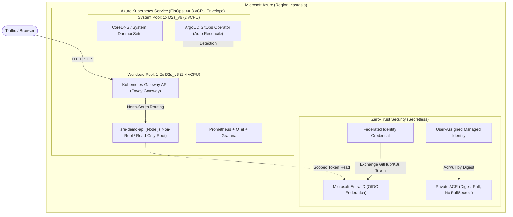
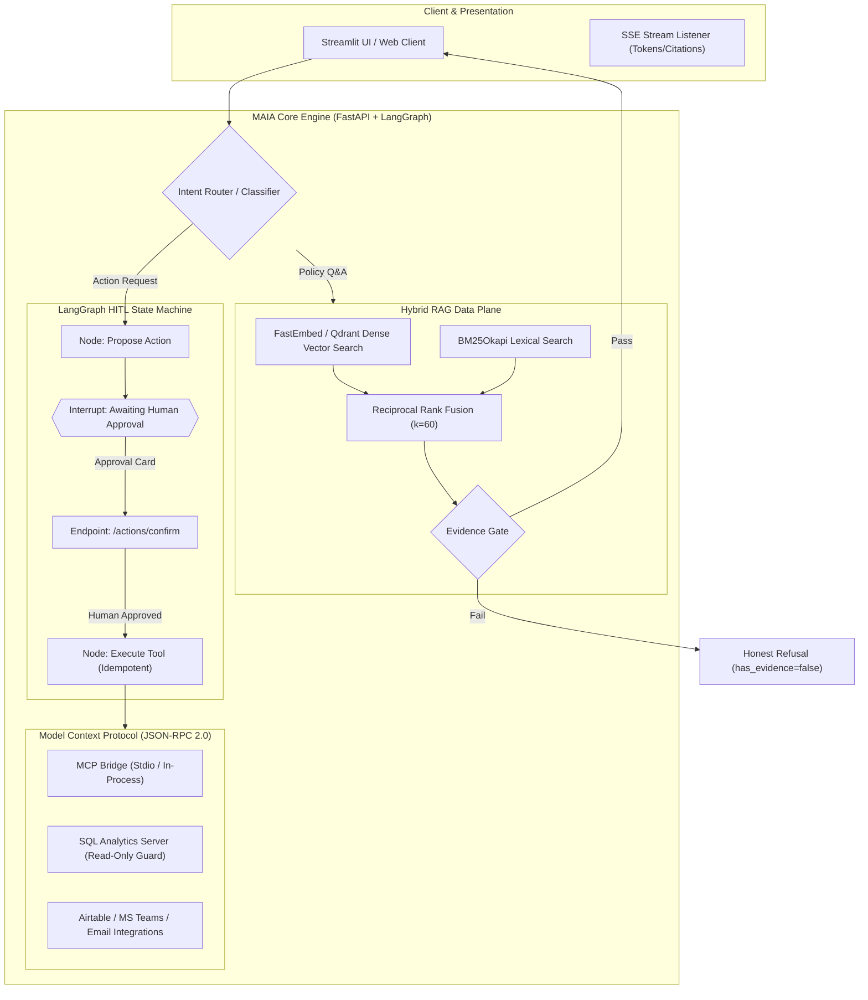

# Portfolio Master Cheatsheet & Interview Defense Guide

> **Cặp đôi dự án thực chiến (Production-Grade Dual Portfolio):**
> 1. **`AKS-SRE-Platform`**: Cloud-Native Platform Engineering, GitOps, SRE, FinOps & Zero-Trust Infrastructure trên Azure.
> 2. **`MAIA`**: Enterprise Agentic RAG Platform, LangGraph HITL, Model Context Protocol (MCP) & PromptOps.

---

## 1. Kiến Trúc Tổng Thể (System Architecture)

### Sơ đồ 1: AKS-SRE-Platform (Nền Tảng Vận Hành & Hạ Tầng)

---

### Sơ đồ 2: MAIA (Enterprise Agentic AI Application)

---

## 2. Kịch Bản Demo 3 Phút (3-Minute Live Interview Walkthrough)

| Thời gian | Trọng tâm demo | Thao tác / Lệnh thực hiện | Kết quả hiển thị (Showcase) |
|---|---|---|---|
| **0:00 - 1:00** | **MAIA: Grounded RAG & Honest Refusal** | Chạy `scripts/run_demo_e2e.sh` hoặc truy cập Azure endpoint: `POST /chat` `"Chính sách nghỉ phép?"` `POST /chat` `"Thưởng tiền Bitcoin?"` | • Câu hỏi 1: Trả về câu trả lời kèm trích dẫn chuẩn `[S1]`, `[S2]`. • Câu hỏi 2: `has_evidence: false`, hệ thống từ chối lịch sự và trung thực. |
| **1:00 - 2:00** | **MAIA: LangGraph HITL & MCP Tools** | `POST /agent/chat` `"Xin nghỉ 2 ngày từ 15/09"` $\to$ Nhận thẻ chờ duyệt `needs_approval` $\to$ Duyệt qua `{"resume": {"approved": true}}` | • Agent dừng tại interrupt, không tự ý ghi dữ liệu. • Sau khi duyệt: Trừ phép thành công (12 $\to$ 10 ngày). • Chạy `python3 -m maia.mcp.bridge --list-tools` hiển thị các công cụ chuẩn JSON-RPC 2.0. |
| **2:00 - 3:00** | **AKS-SRE: Platform Credibility & FinOps** | Mở GitHub Actions của `AKS-SRE-Platform` hoặc review file [`.github/workflows/pr-gate.yaml`](file:///Users/mainguyenbinhtan/Downloads/Projects/AKS-SRE-Platform/.github/workflows/pr-gate.yaml) | • CI 100% xanh: `terraform test` chạy offline không mock dối trá, Trivy scan nhị phân có checksum SHA256. • Giải thích FinOps Envelope: Quota 10 vCPU, sizing hệ thống $\le 8$ vCPU, transient validation kiểm chứng Workload Identity rồi teardown về 0 vCPU. |

---

## 3. Ma Trận Phòng Thủ Phỏng Vấn (Hardest Questions Defense)

### ❓ Nhóm Câu Hỏi 1: Cloud & Platform Engineering (AKS-SRE)

**Q1: Tại sao bạn không dùng Ingress-Nginx mà lại dùng Gateway API?**
> *"Ingress-Nginx đã đi vào giai đoạn bảo trì/retire của cộng đồng Kubernetes upstream và bị hạn chế về khả năng chia sẻ đa tenant (thiếu sự phân tách rõ ràng giữa cluster operator và application developer). Tôi chọn **Kubernetes Gateway API + Envoy Gateway v1.9** vì đây là tiêu chuẩn chính thức mới của CNCF, hỗ trợ mô hình quyền rõ ràng (GatewayClass $\to$ Gateway $\to$ HTTPRoute) và kiểm soát traffic north-south an toàn giữa các namespace độc lập."*

**Q2: Làm sao hệ thống của bạn đảm bảo Zero-Trust mà không bị rò rỉ Service Account Key?**
> *"Chúng tôi loại bỏ 100% private keys hay passwords tĩnh. Thay vào đó, chúng tôi triển khai **Azure Workload Identity** với Entra ID OIDC Federation. ServiceAccount trong cluster ánh xạ trực tiếp sang Federated Identity Credential. Pod xin JWT token cục bộ từ kubelet, sau đó trao đổi lấy Entra token ngắn hạn để truy cập tài nguyên Azure. Ngoài ra, Kubelet Managed Identity kéo private container image từ ACR bằng **digest**, không cần bất kỳ `imagePullSecret` nào."*

**Q3: Bạn giải quyết bài toán chi phí (FinOps) và hạn mức quota trên Cloud như thế nào?**
> *"Tôi thực hiện đo đạc thực tế trước khi cấu hình: Subscription bị giới hạn trần 10 regional vCPU. Thay vì yêu cầu tăng quota vô tội vạ hoặc chọn bừa VM to, tôi thiết kế cụm theo **Transient Envelope (tối đa 8 vCPU)**: System pool `1 × D2s_v6` (2 vCPU) + User pool `max 3 × D2s_v6` (6 vCPU), luôn dư 2 vCPU an toàn. Mọi đợt validation đều chạy theo chu trình tự động: Apply $\to$ Chạy 19 gate kiểm chứng $\to$ Teardown ngay trong phiên làm việc, duy trì chi phí thực tế $<\$0.50$."*

---

### ❓ Nhóm Câu Hỏi 2: AI & LLM Systems (MAIA)

**Q4: Tại sao Gate 8B của MAIA lại fail, và tại sao bạn không chỉnh threshold để cho nó pass?**
> *"Đó là quyết định kiến trúc quan trọng nhất của tôi (ghi rõ trong **ADR-006**). Khi kiểm thử trên tập Golden Dataset (98 test cases), tôi đo được `max(no-answer)` đạt 0.6957 trong khi `min(answerable)` là 0.3140. Hai phân phối này chồng lấn lên nhau vì Cosine Similarity chỉ đo **Topical Relevance (độ gần gũi về chủ đề)** chứ không đo **Answerability (tính trả lời được)**. Một câu hỏi về lương hưu vẫn kéo về đoạn văn chính sách nhân sự với điểm 0.70 dù đoạn văn không hề có thông tin lương hưu. Nếu tôi chỉnh threshold lên $>0.70$ để pass bài test từ chối, tôi sẽ vô tình từ chối luôn các câu hỏi hợp lệ. Tôi chọn công bố lỗi đo đạc này một cách trung thực và tách kiến trúc thành 2 tầng: Tầng 1 lọc chủ đề qua RRF, và Tầng 2 dùng NLI Entailment verification."*

**Q5: Làm sao để đảm bảo Agent không tự ý thực thi các hành động nguy hiểm (destructive actions)?**
> *"Chúng tôi áp dụng mô hình **Human-in-the-Loop (HITL)** với LangGraph StateGraph và durable checkpointer (SQLite/Postgres). Bất kỳ công cụ nào gây side-effect (tạo IT ticket, trừ ngày phép, cập nhật CRM) đều đi qua node `propose_action` và kích hoạt hàm `interrupt()`. Trạng thái thực thi được đóng băng an toàn thành một `pending_action` card và trả về mã HTTP `needs_approval`. Chỉ khi con người gửi request phê duyệt tường minh vào endpoint `/actions/confirm`, đồ thị mới tiếp tục chạy từ điểm ngắt."*

**Q6: Hệ thống của bạn đã thực sự chạy trên Cloud chưa?**
> *"Đã chạy và được kiểm chứng trực tiếp trên **Azure Container Apps** tại endpoint `https://ca-maia-api.wittysand-b748274c.eastasia.azurecontainerapps.io`. Script kiểm chứng `scripts/deploy_check.py` chạy qua 5 bước nghiêm ngặt: Health/Ready probe, JWT Auth, RAG Query với trích dẫn `[S1]`, và Ingestion động vào Qdrant Cloud. Toàn bộ 16/16 checks đều đạt PASS với thời gian phản hồi 17.5s, chạy trên Consumption Tier với chi phí duy trì $\approx \$0.00$ khi nhàn rỗi."*

---

## 4. Bảng Tra Cứu Minh Chứng Kỹ Thuật (Evidence Index)

| Chủ đề kiểm chứng | Vị trí file mã nguồn / bằng chứng |
|---|---|
| **AKS Hardened CI & Test** | [`.github/workflows/pr-gate.yaml`](file:///Users/mainguyenbinhtan/Downloads/Projects/AKS-SRE-Platform/.github/workflows/pr-gate.yaml), [`terraform/aks-foundation/tests/aks_foundation.tftest.hcl`](file:///Users/mainguyenbinhtan/Downloads/Projects/AKS-SRE-Platform/terraform/aks-foundation/tests/aks_foundation.tftest.hcl) |
| **AKS Modularity & Decoupling** | [`terraform/modules/aks_cluster/`](file:///Users/mainguyenbinhtan/Downloads/Projects/AKS-SRE-Platform/terraform/modules/aks_cluster), [`terraform/modules/acr_attachment/`](file:///Users/mainguyenbinhtan/Downloads/Projects/AKS-SRE-Platform/terraform/modules/acr_attachment) |
| **AKS Remote State Foundation** | [`terraform/aks-foundation/versions.tf`](file:///Users/mainguyenbinhtan/Downloads/Projects/AKS-SRE-Platform/terraform/aks-foundation/versions.tf) (`rg-aks-tfstate` / `stakssre`) |
| **MAIA Live Azure Proof** | [`docs/evidence/MAIA_AZURE_LIVE_PROOF.md`](file:///Users/mainguyenbinhtan/Downloads/Projects/MAIA/docs/evidence/MAIA_AZURE_LIVE_PROOF.md) (16/16 checks PASS) |
| **MAIA One-Command E2E Demo** | [`scripts/run_demo_e2e.sh`](file:///Users/mainguyenbinhtan/Downloads/Projects/MAIA/scripts/run_demo_e2e.sh) |
| **MAIA Gate 8B Decision & ADR** | [`docs/adr/0006-answerability-vs-topical-similarity-gate.md`](file:///Users/mainguyenbinhtan/Downloads/Projects/MAIA/docs/adr/0006-answerability-vs-topical-similarity-gate.md) |
| **MAIA MCP Protocol Implementation** | [`src/maia/mcp/`](file:///Users/mainguyenbinhtan/Downloads/Projects/MAIA/src/maia/mcp) (`protocol.py`, `bridge.py`, `servers/`) |
